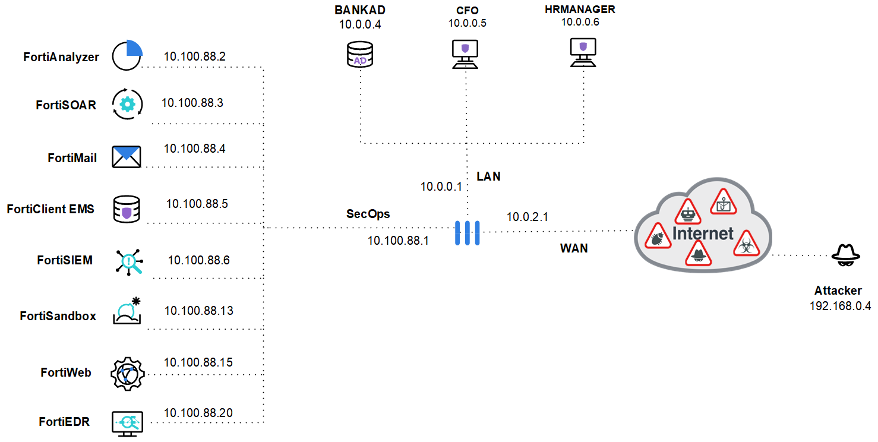

## A. Lab Guide Notes

### Exploring vs Tasks

This lab guide will walk you through some basic use cases with FortiSOAR. There will be sections that only focus on exploring and others that focus on actual tasks that need to be completed. Look for the icons below to help you understand when you will be expected to make changes.

| Exploring | Tasks |
| :-----------: | :-----------: |
|  |   |

### Bonus Points :money_with_wings:

Scattered throughout the lab you will find various Bonus Points activities. These *extra* challenges are not required for completing any task in this workshop, but doing so will help solidify your understanding of the inner workings of FortiSOAR.

## B. REVIEW AND ACCESS TO THE LAB

The **FortiDemo-ThreatLab-7.4** in [FNDN>FortiDemo](https://fndn.fortinet.net/index.php?/fortidemo/instances/) has a lot of useful components we will use in this workshop. For this workshop we will only need access to the following resources that are in that environment:

- FortiSOAR
- FortiMail
- FortiGate
- FortiAnalyzer

However, you are welcome to use this environment to expand and test other integrations beyond what this lab guide covers to provide other POCs (proof of concepts) for your audience.
