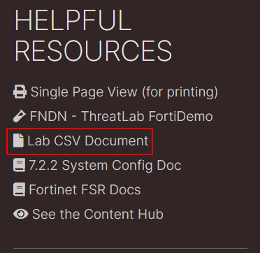

In this workshop we will use FortiMail as our SMTP server.

- Access the FortiMail admin access by clicking on the "Corporate FortiMail" **HTTPS** button from your demo instance or by browsing to `https://<your instance>.fortidemo.fortinet.com:14001/admin/`


- Login with user/pass: fortinet/```$3curityFabric```


<!-- - Download the *fortisoar-workshop-fortimail-users.csv* file {}Here{} or in your Helpful Resources area to the left labeled **Lab CSV Document**.

Password: `p9iFpVjg` -->

- Download the *fortisoar-workshop-fortimail-users.csv* file {}Here{}


- Navigate to the **Domain & User > User section** and import the *fortisoar-workshop-fortimail-users.csv* file by clicking **Import CSV** and uploading the file


{}
You should now have FortiSOAR users in FortiMail. If you do not, you may need to refresh (F5) the page.
{}
