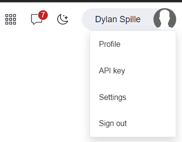
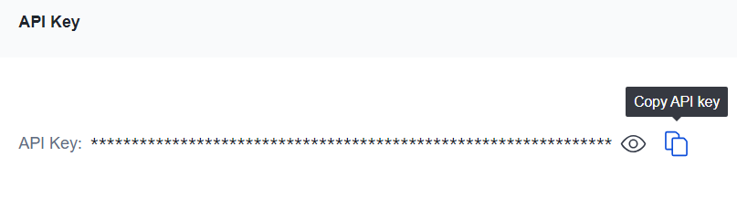
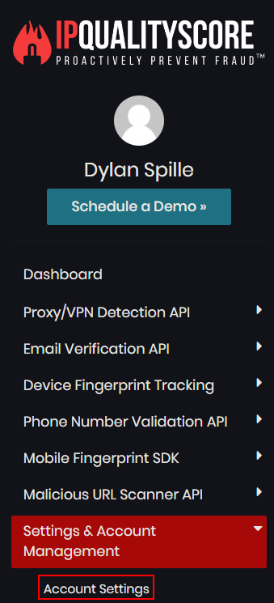

In this workshop we have playbooks that will leverage external accounts that we can get started for free. Proceed to the respective websites below and if you don’t have an account create one, and then retrieve your API Key if you do not have one.

---

## VIRUSTOTAL

- Visit [VirusTotal](https://www.virustotal.com) and create a free account if you don’t have one.
- Under your profile (at the top right), click the API Key option

- Copy and Save your API Key.

---

## IPQUALITYSCORE

- Visit [IP Quality Score](https://www.ipqualityscore.com/) and create a free account if you don’t already have one.
- Sign into IP Quality Score. On the left pane navigate to **Settings & Account Management** > **Account Settings**.

- Under **Account Information** find your API Key Copy and Save your API Key.

- Copy and Save your API Key.

