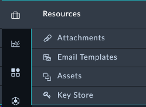

Now we’ll explore the Resource modules of the system. Click around and checkout the record types inside this record group. Feel free to click:  to see what fields are used for records of the different modules. You can create records and delete records to just get a feel for the system if you like.

---
The Resources Group is where records that could be known assets, documents, and/or email templates are stored.

|Module Name|Description|
|:-----:|:-----:|
|Attachments| A module for storing documents of multiple types.|
|Assets| An index of assets that can store a variety of hardware or software assets known to the organization. **Could be used in many business operations**.|
|Email Templates|Email Templates used by the system or other forms of communication.|
