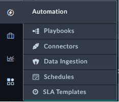

Finally, we’ll explore the Automation modules of the system. Click around and check out the record types inside this record group.

---

|  Module Name   |                                                                          Description                                                                           |
|:--------------:|:--------------------------------------------------------------------------------------------------------------------------------------------------------------:|
|   Playbooks	   |                                              The playbooks module is where all the automation actions are hosted.                                              |
|  Connectors	   |   Also known as the Content Hub. Connectors are what playbooks use to build steps in a workflow. Those steps can connect to external or internal resources.    |
| Data Ingestion |              Data Ingestion is specific playbooks designed to fetch and handle data from external resources (like logging, SIEM, ticketing, etc…)              |
|   Schedules    |                                              The schedule resource is where you define what playbooks need to run                                              |
| SLA Templates  | SLA Templates are used in defining when records need to be acknowledged and responded, based on record state, and the timers are based on the record severity. |
