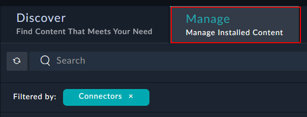
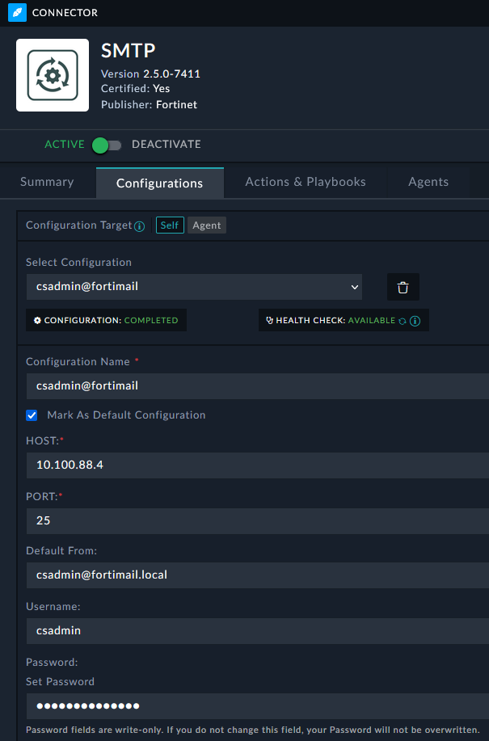
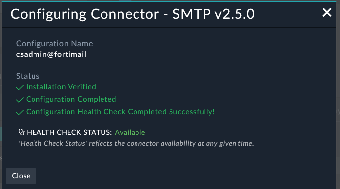

We want to setup an SMTP configuration for FortiSOAR communications if not already setup. If this is already setup or you are in an environment with different mail server options then you can just use this as a review to your communication configuration.

---

- Go to **Automation** > **Connectors**. 
- In the Manage Tab search for **SMTP**.


- Open the SMTP connector by clicking anywhere within the highlighted red box.


{}
This is how you open all connectors, solution packs, and widgets in the Content Hub
{}

- Confirm that the configuration matches the below settings. If not, configure the connector to match the below settings

|||
|:-----:|:-----:|
|Configuration Name:|```csadmin@fortimail```|
|Mark as Default Configuration:|*Checked* |
|Host:|```10.100.88.4```|
|Port:|25|
|Default From:|```csadmin@financial.local```|
|Username:|```csadmin```|
|Password:|```$3curityFabric```|
|Use TLS:| *Unchecked*|
|Timeout:|10|



- If you created a new configuration you should see successful status messages when you save.

