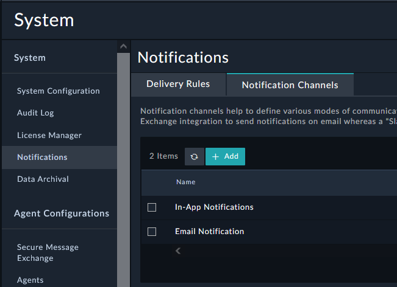
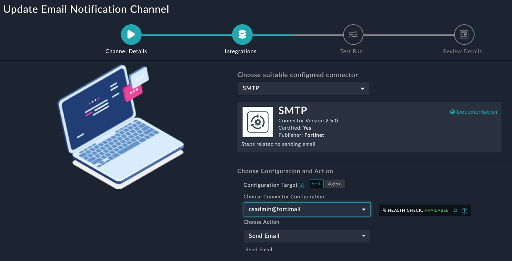

We want the system to use FortiMail as the SMTP host for email notifications. We will make this change inside the Notification Channel if needed. We will test our notification channel with a system user in a future step.

---

1. Navigate to System Settings (Gear Icon at the top right). 

2. Go to **System > Notifications > Notification Channels** and *double click* the text **Email Notification** to open the record 

3. Click the continue button.

{}
If not set to SMTP then change the “Choose suitable configured connector” to SMTP. If the SMTP config is set to **localhost-postfix** modify the SMTP Configuration to use **csadmin@fortimail**.
{}

1. Click  at the bottom right until you can click 

---

### Bonus Points :money_with_wings:

- Navigate to **System > Notifications > Delivery Rules**
  - Edit a delivery rule. How will the notification activate?
  - What will the notification do when it is activated?