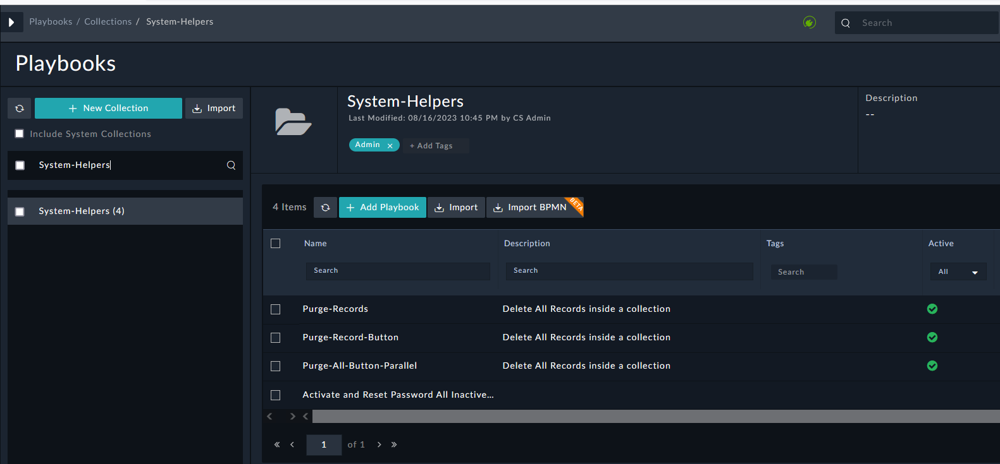
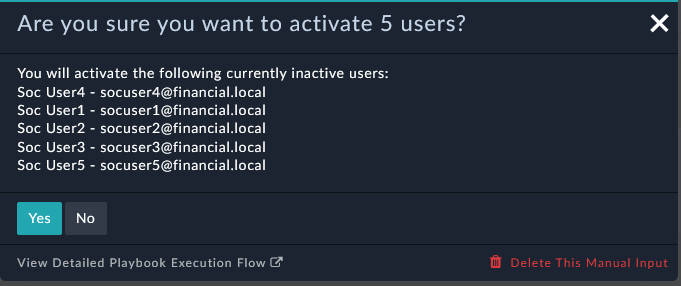

We want to make sure the users we imported through the FortiSOAR **Import Wizard** are active. Users that are imported are disabled by default and their passwords are not created. Look at the user status and take note of the **Active** column of the users. Only the CS Admin User is enabled

---

- First, we need to make sure all the users show as **Active**. If everyone is active then in theory you can skip the rest of this section or review it for information purposes. If you have ANY problems logging in as a Soc User then revisit this section and perform the **activation** and **set password** actions. You can find all of this under **System>Security Management>Users**
- If there is not a green check then you need to **activate** the users one at a time and also **set the password** to the lab default of ```$3curityFabric```. This can be a time-consuming manual process. If your users are not active go ahead and activate one manually if you’d like. Be sure to reset the password to the default ```$3curityFabric```

*Alternatively, you can use a playbook to simplify your efforts as a FortiSOAR admin and script the activation and password setting for each user. See the next step for details.*


---

1. Go to **Automation>Playbooks**


1. Search for the playbook collection ```System-Helpers``` in the left search, select it from the search results


- Find the playbook called “Activate and Reset Password All Inactive Users”. Select the checkbox on that playbook and **Activate** it by clicking the Activate Button. 

---

In order to execute this playbook you need to go to the Simulations menu item so you can reach the Scenario module. Now that you’ve activated the playbook it is ready.

---

1. Navigate to the Simulations Module on the navigation bar (Bottom left of the screen)


2. To use the playbook, find the Activate Users item using the Execute button, in the Scenario module. If you execute this playbook it will activate the inactive users AND reset their passwords for you.
3. Click Yes on the popup to proceed 

---


### Bonus Points :money_with_wings:

- If you executed this playbook then feel free to check out the playbook logs using the  button and look at the **Activate User** playbook to see how we did this.

- You can also click **Edit Playbook** to see how the playbook was created. 
