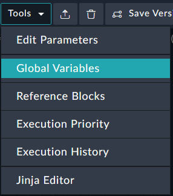
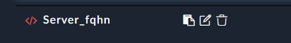
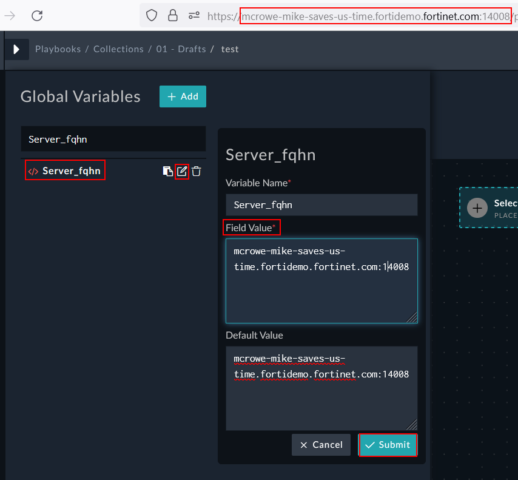

When emails leave FortiSOAR, they provide links back into the system. If the Server’s FQHN (Full Qualified Host Name) is not accurate, then when users receive emails from SOAR the hyperlink will be wrong. We will fix this for the lab.

---

1. Go into **Playbooks > Collections > 01 – Drafts** and create a playbook with a name of “test” using the *Add Playbook* Button.  

1. Open the **Tools > Global Variables** section inside the newly created playbook.
  

1. Look at the URL for your FortiSOAR Instance. This will likely be something like “username-demo_name-fortidemo.fortinet.com:port_number” but may vary depending on your environment.

{}
Our objective is to set the FQHN so that a user will be emailed the right URL that will get them back to the FortiSOAR instance.
{}

1. Click the pencil icon to the right of Server_fqhn and change the **Field Value** appropriately 

1. Click the Submit button once you're done

{}
Make sure you put the **:port** AND the **server name** only.  Do not add the **https:** or **slashes**
Bad **Server_fqhn** Examples :thumbsdown:

- <https://dspille-threatlab-three.fortidemo.fortinet.com:14008/>

- dspille-threatlab-three.fortidemo.fortinet.com:14008/
{}

{}
Good **Server_fqhn** Example :thumbsup:

- dspille-threatlab-three.fortidemo.fortinet.com:14008
{}
