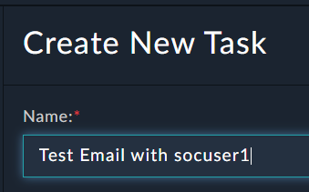
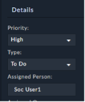
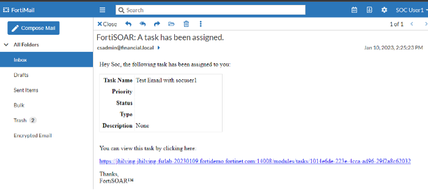
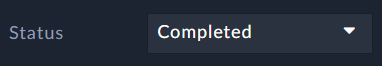

Now we can use a task assignment to test our email links. If you cannot assign a Soc User then revisit the “Enable System Users” section from a previous step.

---

1. Go to **Incident Response > Tasks** and **Add** a New Task. 

1. Give the task a simple name, like: **“Test Email with socuser1**".


1. Set the **Priority** to **High**. Set the **Type** to **To Do**. **Assign** the task to **Soc User1**. Click **Save**.


1. Open a Private Browser or a New Browser and go to your FortiMail.
    - Remove the “**/admin/**” from the FortiMAIL URL to access the web-mail login page.
    - Login using “socuser1” and ```$3curityFabric``` and check your emails.
    - You should have an email saying, “**A task has been assigned**”.
    - Open the email and click the link to the task and then login to FortiSOAR using “socuser1” and ```$3curityFabric```. 

---

1. We need the user csadmin to be signed in
   - Go back to the browser that has the user `csadmin` signed in
   - **OR** sign out from socuser1 and sign in as csadmin```$3curityFabric```.
2. Navigate to **Incident Response > Tasks**
3. Set the Task **Status** to **Completed** 
4. Close the task window. 
