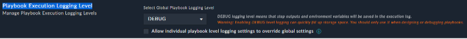

Creating and troubleshooting playbooks can be tough without seeing all the information in the logs. However, storing all the information takes considerable resources and storage, so the default is to not save playbook information.
For this lab we will enable DEBUG level logging by default so we can analyze everything in the system. In production you would want to be more selective about doing this and you can do this per playbook instead or only on error.

---

- As the csadmin user, go to System Settings **System -> System Configuration -> Application Configuration**. *Use the System gear icon to get here* 
- Find Playbook Execution Logging Level
- Set the **Global Playbook Logging Level** to **DEBUG** if it is not already.
- Uncheck “Allow Individual Playbook level logging settings to override global settings” if it is set.
- Save.

