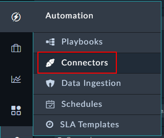

Earlier in this lab you should have retrieved an API token for your VirusTotal account. You will use this here.

---

- Go to Automation and Connectors. 

- In the Manage Tab search for “virustotal”

- Edit the connector configuration to have your Virus Total API Key from section [External Requirements - External Accts]() . You can call the configuration whatever you like – in this lab we called it “mylab”. 

- Paste in your API key to the *API Key* field

- Click save and you should see an Available Health Check Status.

