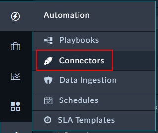
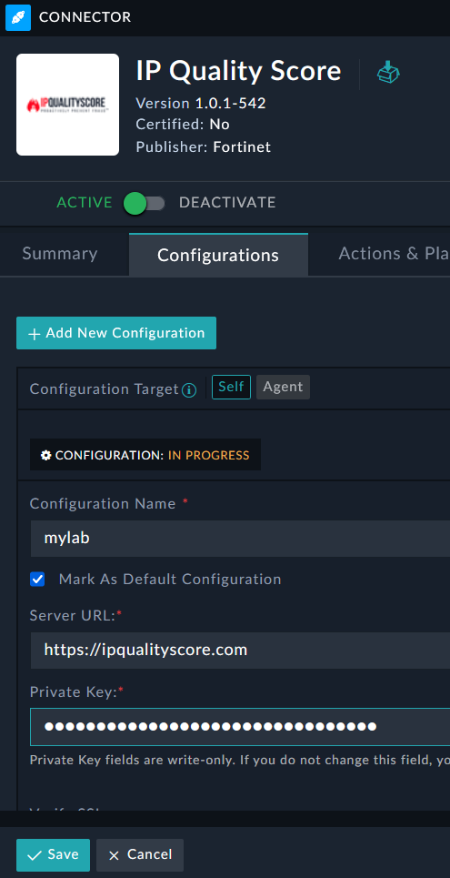
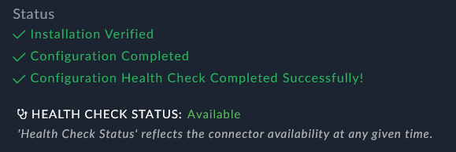

Earlier in this lab you should have retrieved an API token for your IP Quality Score account. You will use this here.

---

1. Go to Automation and Connectors. 
1. In the Manage Tab search for “ip quality score”.
1. Edit the connector configuration to have your IP Quality Score API Key from section [External Requirements - External Accts](). You can call the configuration whatever you like – in this lab we called it “mylab”. 
1. Once saved you should see an Available Health Check Status. 
