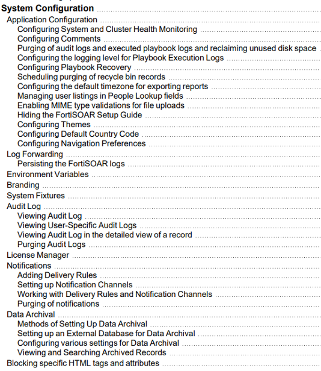

We will briefly review the FortiSOAR system configurations. We will do minimal changes in our system for this workshop but there are lots of opportunities to tweak the system based on your requirements.

Please refer to the documentation **7.4.1 System Config Doc** in the **Helpful Resources** menu location to learn more about ALL the system setting options. Proceed to the next steps to make the required changes for this workshop.

