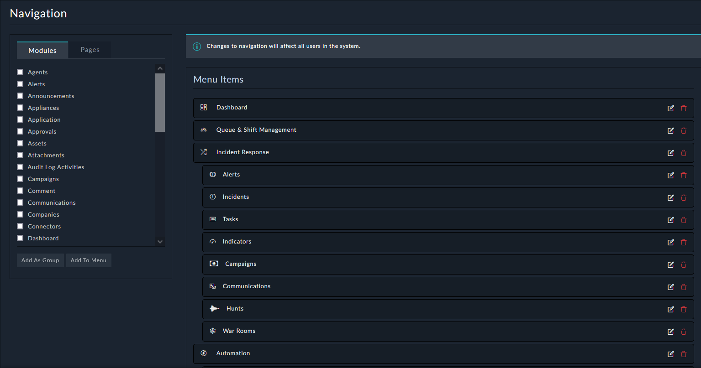

The Navigation Editor allows you to configure different groups for navigation, such as **Incident Response**, **Resources**, and **Automations**. As an example the modules **Alerts**, **Incidents**, **Tasks**, and others are placed into the group **Incident Response** for user navigation for finding these modules.

You can use this to customize or redesign the look and feel of how to navigate FortiSOAR based on business and/or technical needs. We will create our own module later in this workshop.

---

The Navigation Group is defined in Settings>Application Editor>Navigation. |
