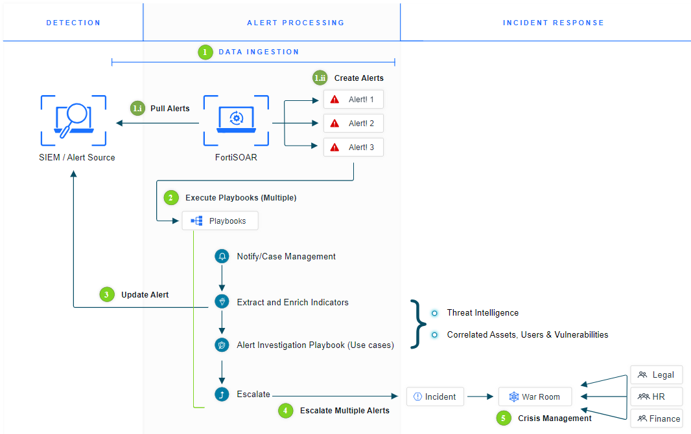

FortiSOAR is a platform that is designed to organize records, actions, and workflows.
The [SOAR Solution Pack](https://fortisoar.contenthub.fortinet.com/list.html?contentType=all&searchContent=sOARFramework) adds a more complete framework for SOCs to build workflows for various security tasks. System administrators can extend and tweak components of this framework to meet their needs. This workshop depends on this already being installed which occurs inside the FNDN Threat Lab Demo.

In this section we will simply navigate around the system to better understand use cases with FortiSOAR. The flow of information and actions are important to have a successful solution. A complete list of modules can be found in the [SOAR Solution Pack Contents](https://github.com/fortinet-fortisoar/solution-pack-soar-framework/blob/develop/docs/contents.md) page online.

Use the below flowchart to get an idea of how records flow through FortiSOAR based on the Solution Pack Framework that has been installed for this lab. This can be extensively changed to meet the needs of your business.

## Objectives

- Review FSR's Incident Response Module
- Review FSR's Resources Module
- Review FSR's Automation Module
- Review FSR's System Configurations
- Prepare Configuration Settings for the Workshop

## Time to Complete

Estimated: 30 Minutes
