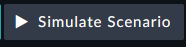
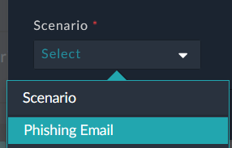
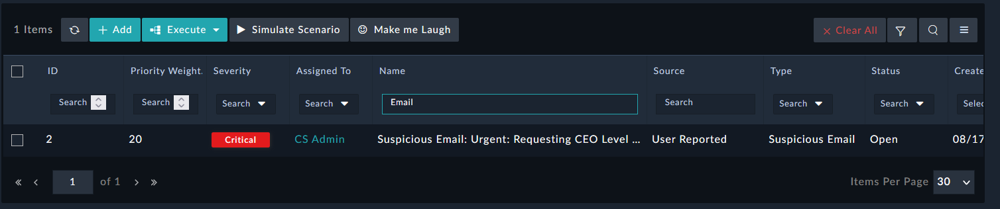

We can now use the scenario generator to create a phishing email alert that needs to be handled as a SOC User.

---

1. Navigate to **Incident Response > Alerts** and click the "**Simulate Scenario**" button. 
1. Select the "**Phishing Email**" Scenario and Start the Scenario.
1. The Alert might come in as **Medium** at first and then will elevate to **Critical**. This is because a linked indicator was found to be malicious.

|||
| :-----: | :-----: |
|||

1. We don’t have much time to meet our SLA! Move to the next step ASAP!
*Don’t worry if you miss your SLA nothing bad happens…unless you’re running in a much more immersive workshop and have a lab manager too. 😉*
 
