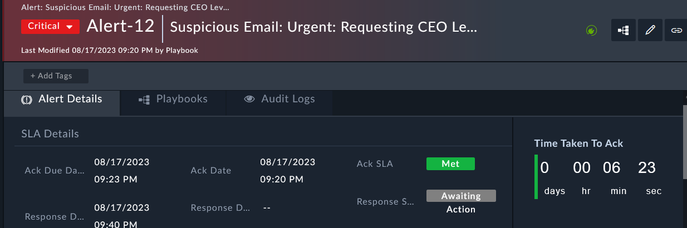

All operational teams work off standard KPIs and "time to acknowledge a problem" is a common one. Inside the FortiSOAR framework we distinguish time to acknowledge an alert by leveraging the status of the alert.

---

- Open the new **Alert** named “**Suspicious Email: Urgent: Requesting CEO Level Demo Environment**”.
- On the right hand corner of the alert we can see “Time Remaining to Ack”.
- Change the status of this alert to Investigating. 
- After a moment you should see the Ack SLA change to Met (if you hit it in time). This can later be used in reporting to see if your team is meeting expectations. 
 
