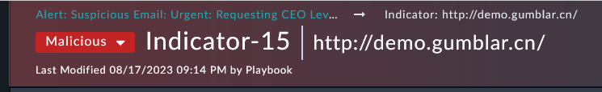
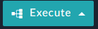

In this **Alert** we can see that we obtained an email and extracted various “indicators” and created a separate **Indicator** record for each. Now that this has been done we can see the linked indicators towards the bottom of the Alert record.

---

1. Inside the **Alert**, navigate to the bottom of the record and look for the **Indicators tab**. 

2. Find the **URL Type Indicator** named `http://demo.gumblar.cn/` and drill into this record. 
{}Notice that when inside an indicator record from the alert record we see “Alert -> Indicator” as our path at the top. This can be used to help navigate you back to the original alert which would be “less clicks” than closing out the window and finding the alert again when you are done with the indicator.{}

3. Inside this opened **Indicator** record look for the Execute button at the bottom of the record  and Execute the “**Block URL**” playbook. 

{}If you do not have a **Block URL** option make sure you selected a “**URL Type**” indicator. Execute buttons can be selectively shown based on type of record.{}

1. Follow the prompts to **Block** and then indicate the **Block Completed** and the status of this indicator should go to “Blocked”.  

{}In a production environment the “Block Complete” step should be configured to actually use a connector, like a FortiGate, for efficiency {}
