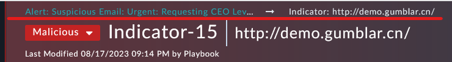
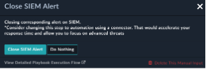

For this use case we blocked our bad indicator and we are ready to close our Alert. Navigate back to the Alert record, the top of the record you’re on leaves a breadcrumb back to the original record.

---

1. Set the Status of the alert to closed. 

1. When promoted, fill out some notes for the closure and provide a reason, then click **Update** 

<!-- 1. We’re prompted to also update our SIEM assuming the alert came from a SIEM. We did not use the SIEM, so just click “Do Nothing”. 

{}In a production environment the “Close SIEM Alert” step would be automatically added to update your environment.{} -->

1. Did we meet our SLA to Respond?  
