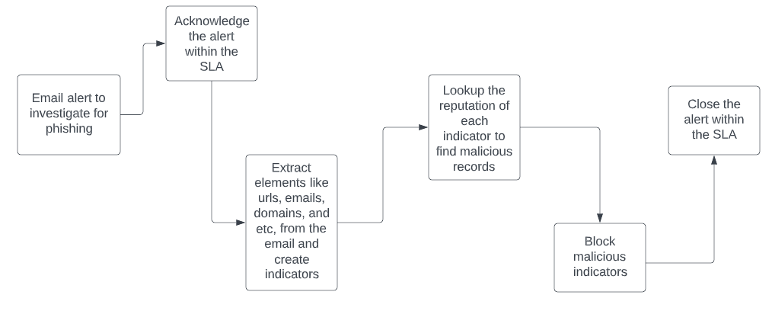

In this example we will leverage a Solution Pack that is designed to simulate a scenario for managing phishing email attempts. The workflow for any given SOC or organization can vary drastically and FortiSOAR is designed to be changed and tweaked as needed to meet those requirements.
In this use case we will be following the below workflow.

## Objectives

- Install the Email Phishing Scenario
- Work through the Email Phishing Scenario

## Time to Complete

Estimated: 30 Minutes
