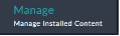
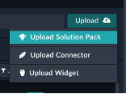
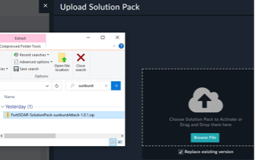
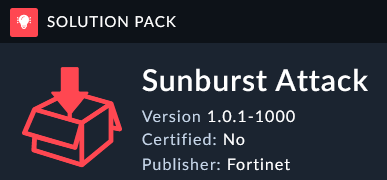

This solution pack we want to install is called **FortiSOAR-SolutionPack-sunburstAttack-1.0.1.zip** can be found {}Here{}.

Password: `p9iFpVjg`

---

1. Under the **Manage** Tab inside the **Content Hub** find the **Upload Solution Pack** button.

|||
| :-----: | :-----: |
|||

2. Check the **Replace existing version** option and install the Solution Pack. 

3. You should have version 1.0.1. 

{}There is a problem in version 1.0.0 where the Hunt record does not get linked to the Indicators which you will see later in this section. If the Content Hub has been updated with a newer version then you could use that instead of uploading the one from this lab guide. {}