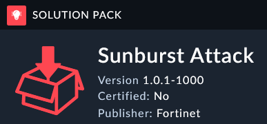

The solution pack we want to install is called **Sunburst Attack**

---

1. On the left Navigation Pane, go to **Content Hub**. 
1. In the Discover Tab search for **Sunburst Attack**.

1. Open the **Sunburst Attack** Solution Pack.
1. On the right pane, Click the install icon -  - to install the Solution Pack
1. Wait for the solution pack to finish installing

1. You should have version 1.0.1. 
