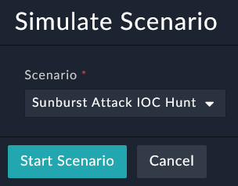

We first want to create a Hunt record that will be used to “Hunt” for IOCs related to the Sunburst Attack. Obviously hunting can be for any objective but in this section we will simulate a hunt for known Sunburst attack indicators.

---

1. Go to the **Incident Response>Alerts** module & click the **Simulate Scenario**

2. Select **Sunburst Attack IOC Hunt** and **Start Scenario** 

3. If you do not see a pop-up then look for the manual input indicator on the upper right hand corner. 
    - You can use the default range here. Click the **Submit** button
    
