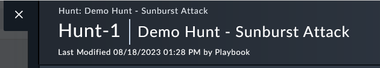

Now that we have a **Hunt** record in this use case we need to create indicators related to our hunt. These indicators can be found in this [github link](https://raw.githubusercontent.com/sophos-cybersecurity/solarwinds-threathunt/master/iocs.csv). We want to create an indicator for each of these and then confirm the reputation from a third party threat intelligence.

We will use the playbook called **Sunburst IOC Hunt** available on this Hunt record we created to perform this task.

---

1. Go to the **Incident Response > Hunt** module. 

1. Open the **Demo Hunt – Sunburst Attack** record. 

1. At the bottom of the record execute the Sunburst IOC Hunt playbook. This will kickoff the process to extract the IOC objects from the ioc.csv file. 
