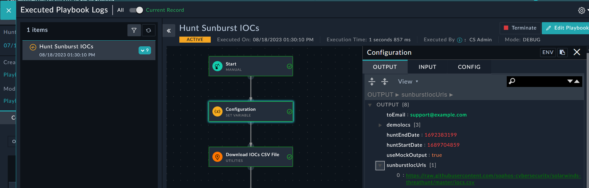
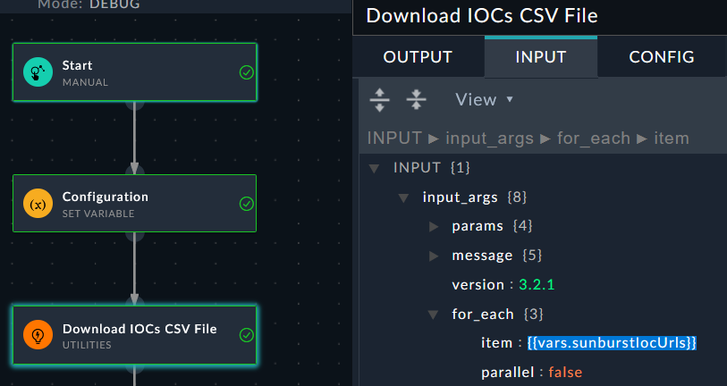
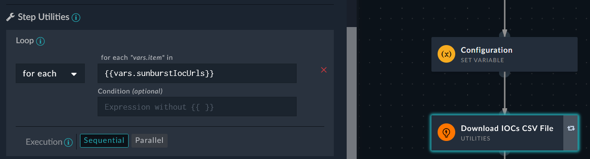
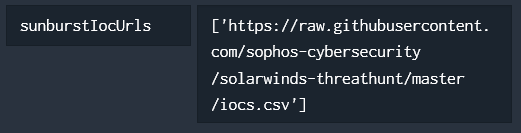

Inside the **Hunt Record, Demo Hunt – Sunburst Attack**, look to the upper right corner and find the playbook logs icon. 
This will open the playbook history for this record. Find the playbook named **Hunt Sunburst IOCs** and open it.

---

1. Look at the **Configuration** step. The **OUTPUT** set the variable called **sunburst_ioc_urls** to the URL we will use to [download the CSV file](https://raw.githubusercontent.com/sophos-cybersecurity/solarwinds-threathunt/master/iocs.csv). 

1. The next step, **Download IOCs CSV File**, has an input configuration to loop on the variable **sunburst_ioc_urls**. 

1. Click the **Edit Playbook** button on the upper right hand corner of the playbook log. Double-click on the **Download IOCs CSV File** step and find the loop configuration.

    |||
    |:-----:|:-----:|
    |||

1. Close the previous step and double-click on the **Configuration** step and find the configuration settings. 
