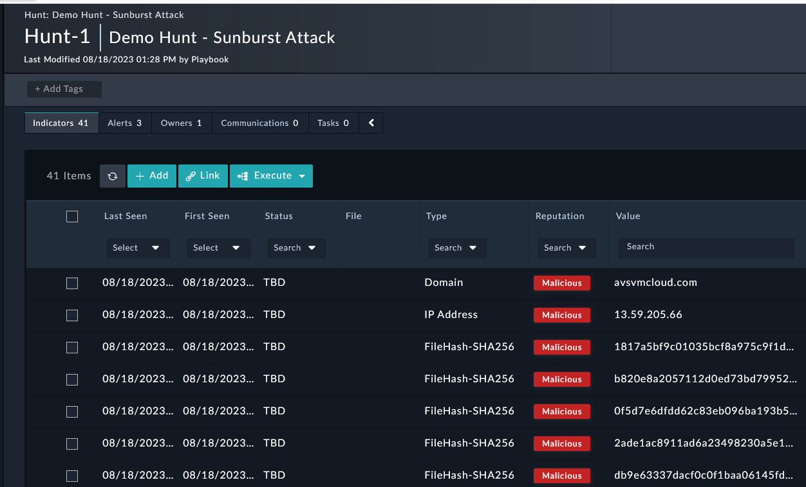

In the **Hunt** record and under the **Correlations** tab we can see the **Indicator** records that were created from this hunt.

---

1. Go back to **Incident Response> Hunts**

2. Open the Hunt Record and scroll down to the Indicators section

3. We have 41 **Indicators** created from the playbook executed in the hunt. 

4. Of our 41 **Indicators** we have created 3 **Alerts** as being “found” in the network in this simulation. These were “found” using the variable “demo_iocs” inside the “Hunt Sunburst Indicator” playbook. 
