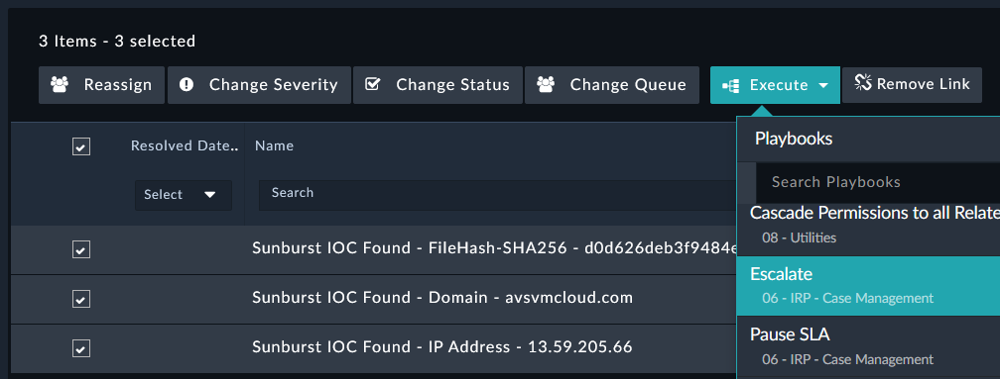
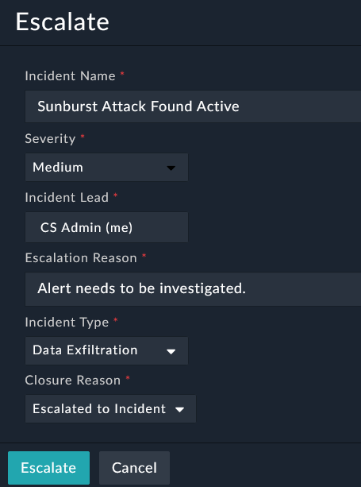
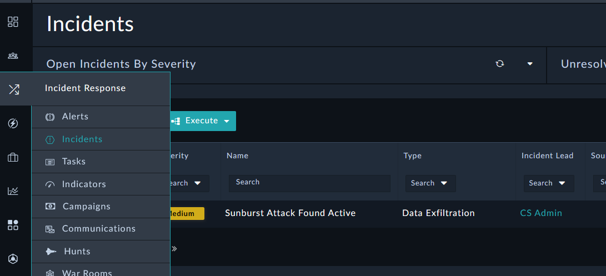

Now that we have **Alerts**, where in this simulated scenario we found active IOCs, related to this **Hunt** we want to escalate these to an **Incident**. Select the 3 **Alerts** and **Execute** the **Escalate** playbook. You will be prompted to fill out initial **Incident** information.

---

1. Select the 3 **Alerts** and **Execute** the **Escalate** playbook.
  

2. Fill out Incident information and click **Escalate**.
  

3. You can now see the new record in the **Incidents** module. 
