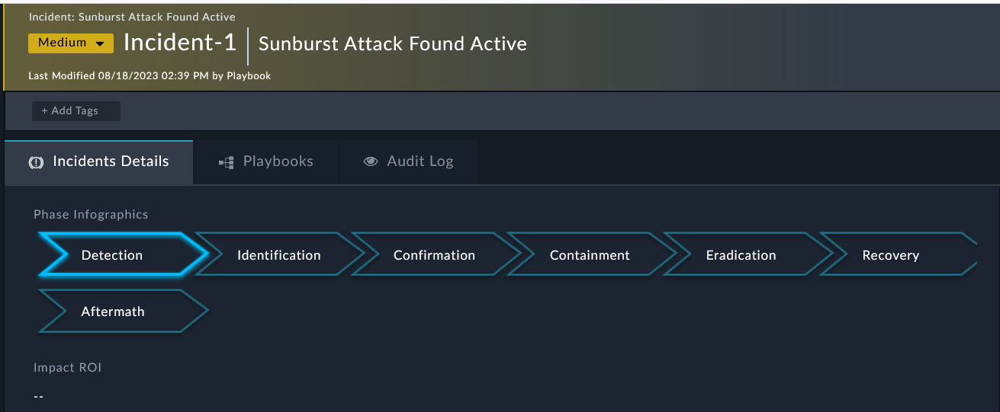
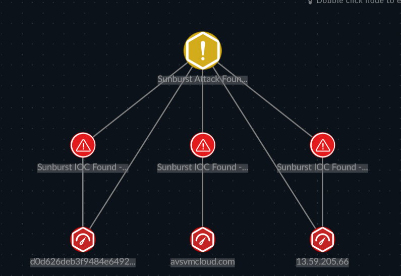

1. The incident aggregates our **Alerts** and provides a way to make sure you are following the business process for your Incident Response workflow. 

2. Inside the **Incident** you can see a visual representation of the **Alerts** and **Indicators** involved in this case. You can toggle the view using the view buttons in the right hand corner.

|||
|:-----:|:-----:|
|||
