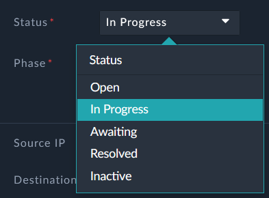
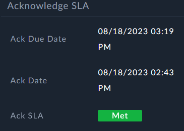
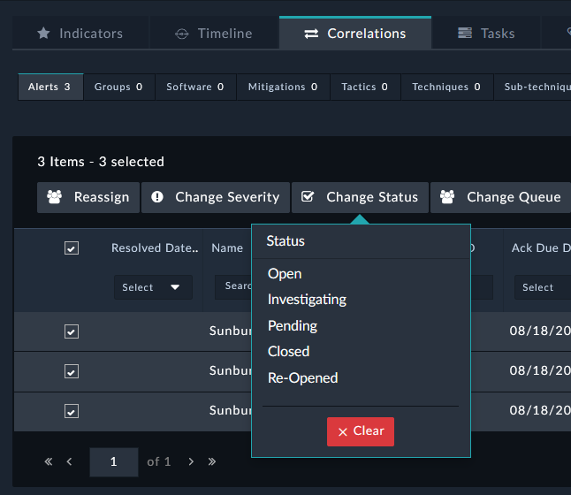
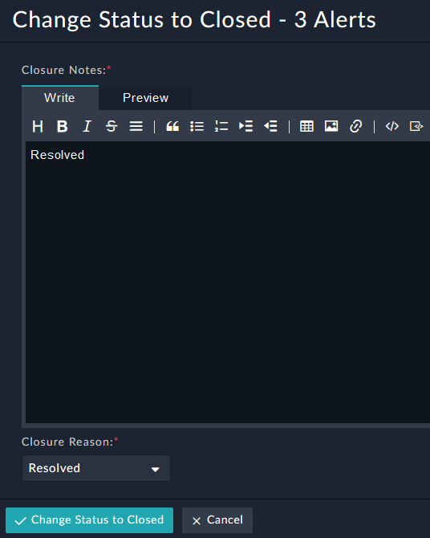
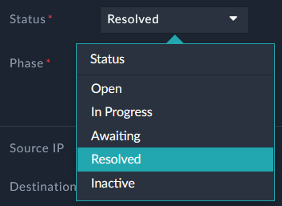
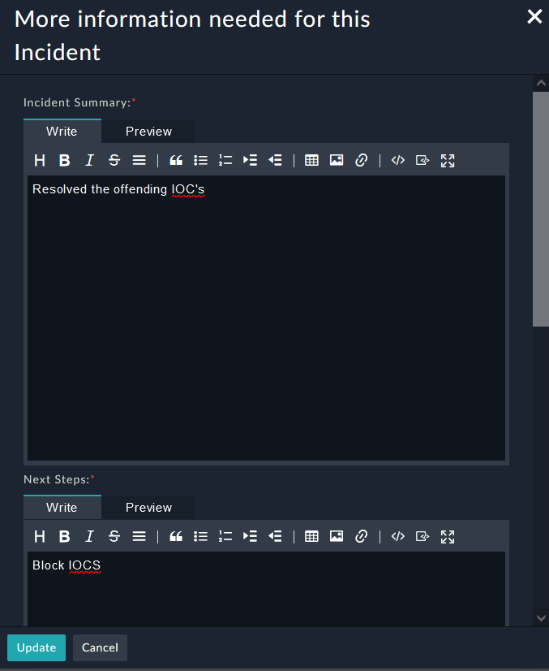

1. First, change the **Status** of the **Incident** to **In Progress**. This will make sure the Incident Ack SLA is met.

|||
|:-----:|:-----:|
|||

1. We want to resolve our **Alerts**. Assuming we have done the steps to do that we can **Close** the **Alerts**. Focus on the **Correlations** tab at the bottom of the page, and then select the **Alerts Tab**.

2. Select all of the alerts using the checkbox and change the status to **Closed**

1. The process for closing Alerts prompts you for some further information. Fill out the required fields and click **Change Status to Closed** 

2. Change the **Status** of the **Incident** to **Resolved**. 

3. The process for closing the **Incident** prompts you for some further information. Make sure to scroll down and fill out the **Resolution** field
4. Click **Update**

