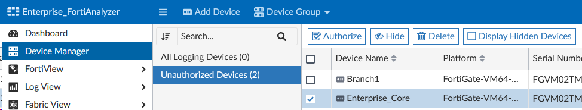

In this section we prep the FortiAnalyzer to receive logs from the Enterprise Core FortiGate

---

1. Access the FortiAnalyzer by clicking on the **Enterprise FortiAnalyzer** **HTTPS** button from your demo instance or by browsing to `https://<your instance>.fortidemo.fortinet.com:14003/` 
2. Sign in with fortinet/```$3curityFabric```
3. Go to **Device Manager> Unauthorized Devices**
4. Select the **Enterprise_Core** FortiGate by checking the box or right clicking, and click the **Authorize** Button

1. Click the OK button on the popup to confirm the authorization.