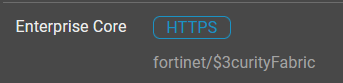

1. Access the FortiGate by clicking on the **Enterprise_Core** **HTTPS** button from your demo instance or by browsing to `https://<your instance>.fortidemo.fortinet.com:14002/` 
2. Sign in with fortinet/```$3curityFabric```

3. Access the integrated ssh via the button at the top right.


1. Run the command “**diagnose log test**” in the CLI console. This will kick off some test events from the FG and will show up. Run the command about 3x in a row to generate more logs.


