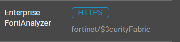
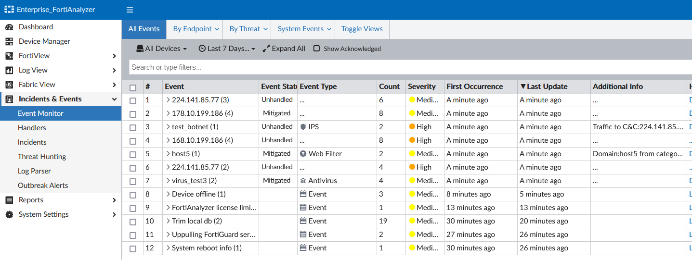

We want to make sure that the FAZ has some events. These are events that we want to be handled via FortiSOAR to turn into to
You should see new events last updated “**A few seconds ago**”.

---

1. Access the FortiAnalyzer by clicking on the **Enterprise FortiAnalyzer** **HTTPS** button from your demo instance or by browsing to `https://<your instance>.fortidemo.fortinet.com:14003/` .
2. Sign in with fortinet/```$3curityFabric```
3. Go to **Incidents & Events > Events Monitor**
4. Confirm you see botnet events created with Medium or High Severity

