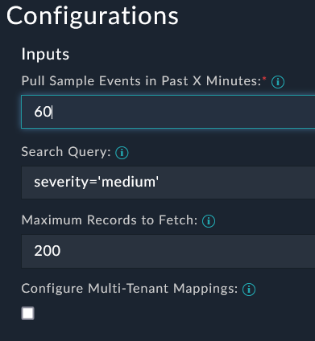
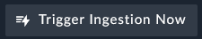

In this section we will configure FortiSOAR to retrieve FortiAnalyzer events.

---

1. Go to the **Data Ingestion** module inside the **Automation** group. 

1. Look for the **FortiAnalyzer Connector**. This was setup by default in the lab but comes from configuring the FortiAnalyzer Connector Config.
1. Click the **1 Configuration Available** dropdown.

1. Click on the **Configure Ingestion** link. 

1. We need to **fetch some data** to see what the data looks like. 

1. You can tweak how you pull the sample data. Increased it to **60 minutes** to make sure you get a good sample

    |||
    |:-----:|:-----:|
    |||

1. The example data needs to be mapped to FortiSOAR fields for creating records. Some defaults have been applied but we can change this. 

1. Click into the **Name** field and change it to include the **devicename** and **subject** of the event. Then **Save the Mapping & Continue**.

    |||
    |:-----:|:-----:|
    |||

1. Schedule the fetch to run every **15 minutes** and **limit the execution to one** active instance at a time. Change the hour from “0”, shown in this picture to “*” to be every 15 minutes.  Then **Save Settings & Continue**. 

1. Click the Trigger Ingestion Now button to kick off the playbook. 
