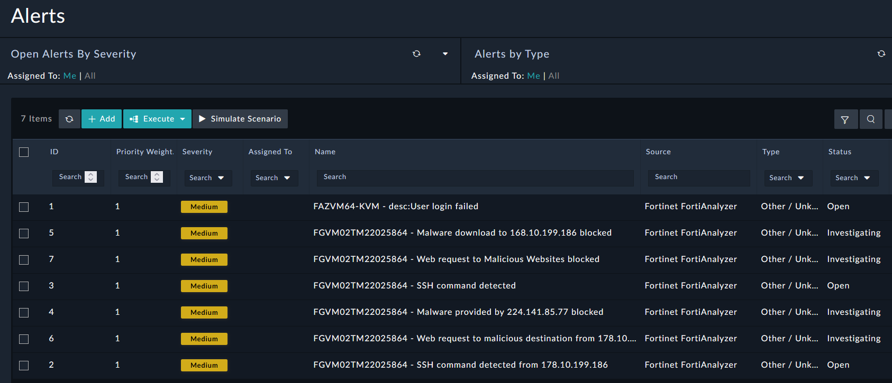

Now that we have Alerts in FortiSOAR we could start working these using our standard operation flow.

### Bonus Points :money_with_wings:

1. Assign 2-3 of these alerts to SocUser2 by clicking the check box on those alerts, and then **Reassign** to **SocUser2**.
2. Login to that users email on FortiMail and confirm the alert notifications were sent to the user.
3. Meet the SLA by closing those alerts as false positives.