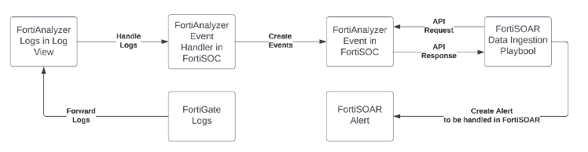

There are multiple ways to integrate with FortiSOAR. In this section we will focus on having FortiSOAR pull from FortiAnalyzer. The FortiAnalyzer Events, created by FortiAnalyzer Event Handlers, will be created as FortiSOAR Alerts via the Data Ingestion process.

## Objectives

- Configure External System Data Ingestion Capabilities
- Work with Data Ingestion Components

## Time to Complete

Estimated: 30 Minutes
