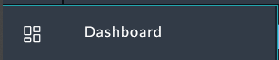

1. Navigate to the newly imported policies Module found under **Resources > Policies**. 

2. Policy Records will be created in this module later in the workshop by running an automation playbook to extract policies from the FortiGate configuration. 

3. The Module configuration can be seen in **System Settings>Application Editor> Modules>Policies**. This is how we build what fields a record inside a module will store. 

4. Go to the Dashboards page from the left Navigation Pane and open the SOC Review Dashboard.

    |||
    |:-----:|:-----:|
    |||

5. This is the dashboard you will use to manage policies populated from your FortiGate config. 
