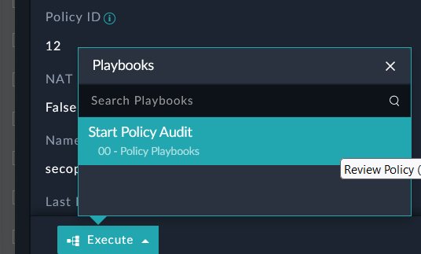

The goal of this section is to complete an audit of the firewall policy and deny a policy. The next steps on removing the policy from the network would depend on other business requirements as our objective is simply to perform an audit.

---

1. Inside **Resources>Polices** click on **secops-to-dmz** to open the policy record. 

2. At the bottom of the page, click the blue **Execute** button, then click “**Start Policy Audit**”. You will see a Manual Input Box appear.

|||
|:-----:|:-----:|
|||

<!-- 3. If you do NOT see a pop-up then look for the Manual Notification in the toolbar.  -->

4. Click on the **Next Steps** field dropdown (sometimes called a picklist), and you will see 3 options. Select **Mark as Denied** and enter “**This should not be allowed**” in the Comments field.
Click **Submit**. 

5. Check the Execution History for this policy by clicking on the  icon at the top right. You will see all of the playbooks that have executed on this specific record. 

6. Wait for the playbook “**> Update comments on the FortiGate**” to complete. (you’re looking for a green check box to the right). 

7. In the FortiGate config we can see that we updated the policy with a comment. (You may need to modify the heading layout of your firewall policy screen to see the comments column). 