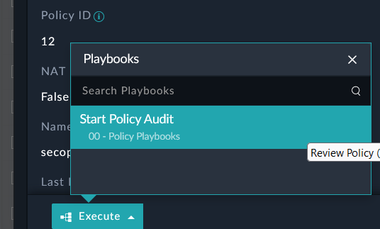

Sometimes we need to engage others to help us through our workflow. In this step we will reach out to another party to provide feedback for our Policy review so we can make a decision when we get a response.

---

1. Inside **Resources>Polices** open the **lan-to-dmz** Policy record.

2. At the bottom of the page, click the blue **Execute** button, then click “**Start Policy Audit**”.

|||
|:-----:|:-----:|
|||

1. Select “**Email NOC Team for additional input**”

2. You will see two new fields appear, Email To and Email Body. Replace *PROVIDE INFO NEEDED HERE* with “**Provide the justification for allowing all ports for the service**” and **Submit** 

3. Using the same steps in the “**Test Emails with a Task**” section above, while on a different browser, access the inbox for SocUser1 using socuser1/```$3curityFabric```


4. Open the “A FortiSOAR playbook is requesting your input” email. 

5. Click the “Open input form” link and fill out the form. 

{}
This page is an external input page which does not require a user license. It gives non FortiSOAR users the ability to provide feedback or take action in FortiSOAR
{}

6. Navigate back to the **Policies** Module as CS Admin. You will see a new Manual Input with the text you previously entered on the previous step. 

7. Click **Response from NOC**

8. Now review the response from Soc User1 and **Approve** the policy and add a comment. Then click **Submit** 
