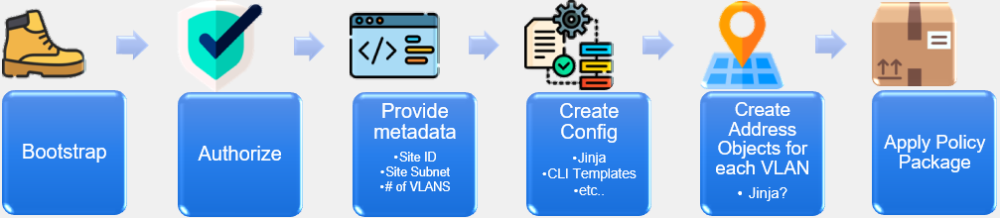

Now that you have a foundational grasp of Zero Touch Provisioning (ZTP) and are familiar with the purpose and location of the FortiSOAR ZTP modules, let's delve into a more detailed discussion of the ZTP Phases. When implementing ZTP, there are distinct categories of tasks that must be accomplished. These tasks are organized into specific phases.

---

The ZTP Phases within FortiSOAR outline what steps a ZTP Profile will take when provisioning a device. The ZTP Phases are as follows:

1. Authorization
   - In this phase, authorization of the device is conducted as necessary. If the device is already modeled, we proceed to the subsequent step. In cases where the ADOM (Administrative Domain) is not set, it is assumed to be at the root level.

2. Device Metadata
   - The Device Metadata phase involves managing device-specific information. This includes the important aspect of notifying users when essential data is missing.

3. Device Groups
   - In the Device Groups phase, the device is added to the appropriate device groups as defined within the ZTP Profile and/or the Device Metadata.

4. Execution of Linked Scripts
   - During this phase, all scripts associated with the device record are executed. It's worth noting that these scripts are not unlinked, but ZTP Profiles can clear linked scripts to avoid redundantly running scripts that should only be executed once.

5. Installation of Device Configuration
   - In this phase, the device's configuration is installed from the FortiManager (FMG) API.

6. Installation of Policy Package
   - The Installation of the Policy Package phase involves installing the policy package from the FMG API. The specific Policy Package name can be derived from the Device Metadata, the ZTP Profile, or, by default, it is based on the Device Name from the Device Record.

7. Completion
   - This final phase signifies the conclusion of the ZTP process, marking it as complete.

These ZTP phases are essential components of the ZTP framework, ensuring a well-structured and methodical approach to device provisioning and configuration management.
