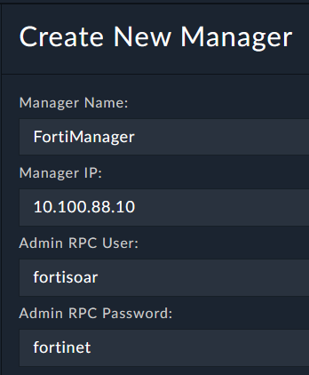
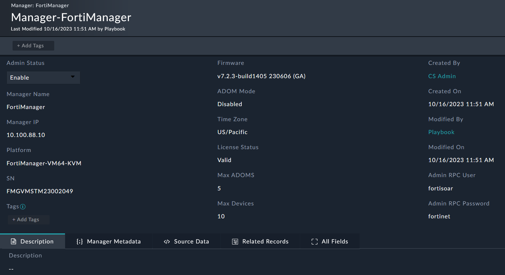
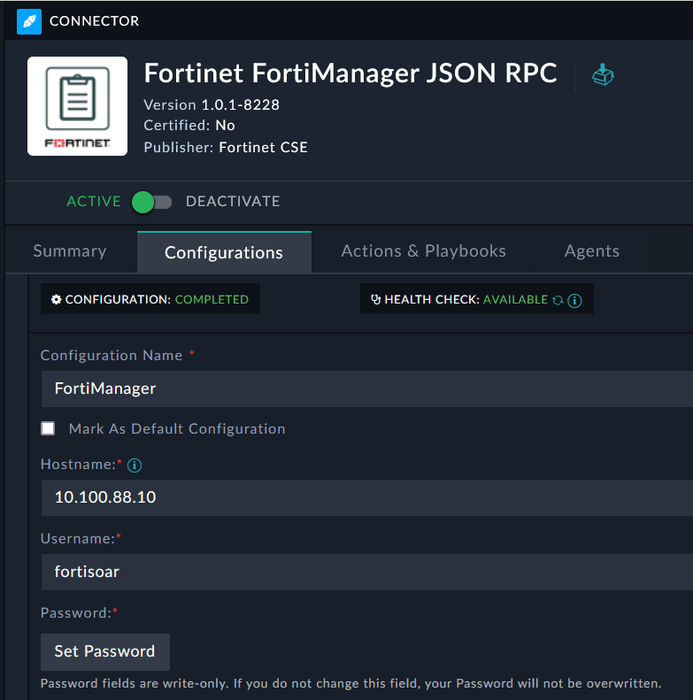

We will begin configuring FortiSOAR to connect to FortiManager. This will allow us to use FortiSOAR to manage FortiManager.

---

1. Navigate to **FortiManager > Managers** and click the **+** button to add a new record.
2. Enter the following information:
    - **Manager Name**: FortiManager
    - **Manager IP**: 10.100.88.10
    - **Admin RPC Username**: fortisoar
    - **Admin RPC Password**: fortinet

3. Click **Save**.

---
You will now see the FortiManager record populated with information from the FortiManager API. FortiSOAR automatically created the connector configuration for us and retrieved details about the device

# Bonus Points :money_with_wings:
Investigate the playbook that triggered when we created the FortiManager record. What did it do?