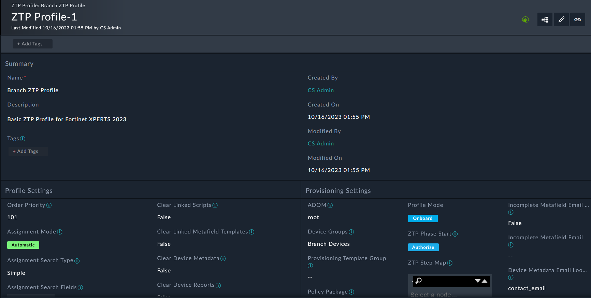
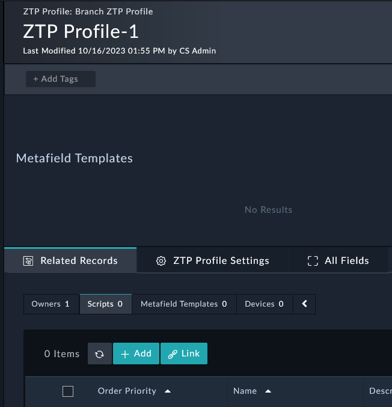

In this section we’ll create a ZTP profile that will be used to configure the FortiGate when it shows up in FortiManager.
---

1. Navigate to **FortiManager ZTP Profiles** and click the **+** button to add a new record.
2. Set the following fields (leave the rest as default):
    - **Name**: ```Branch ZTP Profile```
    - **Description**: ```Basic ZTP Profile for Fortinet XPERTS 2023```
    - **Assignment Mode**: ```Automatic```
    - **Assignment Search Fields**: ```Device Name```
    - **Assignment Search**: ```Branch[1-2]```
    - **Adom**: ```root```
    - **Device Groups**: ```Branch Devices```
    - **Policy Package**: ```Golden Branch```

3. Click **Save**.

Congrats! You made your first ZTP profile. Now we need to add some configuration to it.


---

1. Scroll down to the Related Records tab and click the **+** button on the **Scripts** section add a new record.

2. Set the following fields (leave the rest as default):
    - **Name**: ```Configure an admin user```
    - **Description**: ```This script will create an admin user on a FortiGate for Fortinet XPERTS 2023```
    - **Script Type**: ```Remote CLI```
    - **Script**: ```config system admin
    edit "expert_admin"
        set accprofile "super_admin"
        set vdom "root"
        set password fortinet
    next
end```
3. Click **Create**.

You will now see a new script added and linked to the ZTP profile. This script will be executed on the FortiGate along with other scripts you create based on the order priority.


