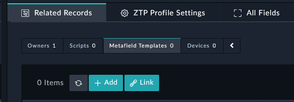
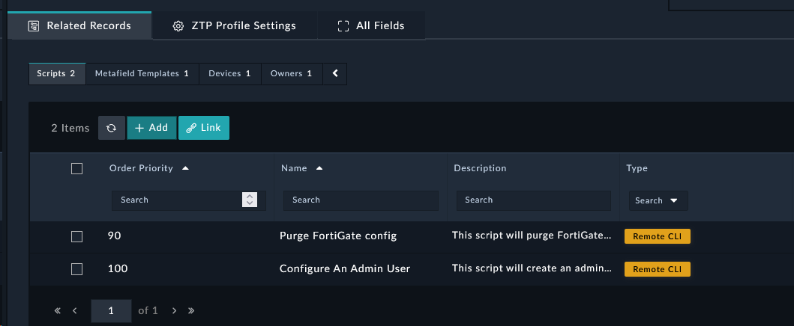

In this section we’ll create a ZTP profile that will be used to configure the FortiGate when it shows up in FortiManager.

---
## Create ZTP Profile
1. Navigate to **FortiManager ZTP Profiles** and click the  button to add a new record.
2. Set the following fields (leave the rest as default):
    - **Name**: ```Branch ZTP Profile```
    - **Description**: ```Basic ZTP Profile for Fortinet XPERTS 2023```
    - **Assignment Mode**: ```Manual```
    - **Assignment Search Fields**: ```Device Name```
    - **Assignment Search**: ```Branch[1-2]```
    - **Adom**: ```root```
    - **Device Groups**: ```Branch_Devices```
    - **Policy Package**: ```Golden_Branch```

{}
You will create a Policy Package and a policy later on. But if you didn't, FortiSOAR would automatically create a package for you.
{}


3. Click **Save**.

Congrats! You made your first ZTP profile. If we stopped here, we would have a ZTP profile that we can manually apply to FortiGates, and it would then automatically add them to the group and policies defined in the ZTP profile, and install the policy. But usually Zero touch configurations need more configuration than just a policy package and device group, so lets see what it takes to set that up.


{}
Keep in mind, we set the ZTP profile mode to **Manual**. We will change this later on.
{}

---
## Create Metafield Template Record

1. Scroll down to the Related Records tab, click the **Metafield Templates** subtab, and click the  button on the **Metafield Template** section add a new record.



2. Set the following fields on the popup (leave the rest as default):
    - **Name**: ```Branch ZTP Variables```
    - **Description**: ```Metafields for Fortinet XPERTS 2023```
    - **Metafield Template**:
         
    ```json
    {
      "contact_email": "socuser1@financial.local",
      "admin_user_name": "xpert_admin",
      "admin_timeout": "120",
      "loopback0_ip": "" 
   }
   ```
3. Click **Create**.
4. You may need to click the refresh button underneath the metafield section if you don't see the new template there. The refresh only affects visibility, not functionality of the template.


You will now see a new metafield template added and linked to the ZTP profile. This Metafield template will be used to populate the metafields for the Script Templates, or be used for overrides on the ZTP profile.

{}
The metafields are used to pass variables to the scripts. The metafields are referenced in the scripts using the following syntax: `{{devmeta.metafield_name}}`
{}

---

## Create Script Records

### Create Script for Purging Config

1. Scroll down to the Related Records tab, click the **Scripts** sub-tab, and click the  button on the **Scripts** section add a new record.

2. Set the following fields on the popup (leave the rest as default):
    - **Order Priority**: `90`
    - **Name**: `Purge FortiGate config`
    - **Description**: `This script will purge FortiGate config for Fortinet XPERTS 2023`
    - **Type**: `Remote CLI`
    - **Script**:
  
    ```text
   	config firewall policy
		purge
	end
	config system sdwan
		config service
			purge
		end
		config neighbor
			purge
		end
		config health-check
			purge
		end
		config members
			purge
		end
		config zone
			purge
		end
		set status disable 
	end
	config vpn ipsec phase2-interface
		purge
	end
	config vpn ipsec phase1-interface
		purge
	end
	config firewall address
		purge
	end
	config firewall service
		purge
	end
    ```

3. Click **Create**.

{}
The order priority is used to determine the order in which the scripts are executed. The lower the number, the higher the priority. The purge script needs to be executed before the other scripts, so we set the order priority to 90.
{}

### Create Script for an Admin Account

1. Scroll down to the Related Records tab, click the **Scripts** sub-tab, and click the  button on the **Scripts** section add a new record.

2. Set the following fields on the popup (leave the rest as default):
    - **Name**: `Configure Admin User and Loopback interface`
    - **Description**: `This script will create an admin user on a FortiGate for Fortinet XPERTS 2023`
    - **Type**: `Remote CLI`
    - **Script**:
   
    ```text
    config system global
      set admintimeout {{devmeta.admin_timeout}}
    end
    config system admin
      edit "{{devmeta.admin_user_name}}"
        set accprofile "super_admin"
        set vdom "root"
        set password fortinet
      next
    end
    config system interface
      edit "Loopback0"
        set vdom "root"
        set ip {{devmeta.loopback0_ip}} 255.255.255.255
        set allowaccess ping
        set type loopback
        set description "Loopback0 for XPERTS"
      next
    end
    ```

3. Click **Create**.

You will now see 2 scripts added and linked to the ZTP profile. This script will be executed on the FortiGate along with other scripts you create based on the order priority.
