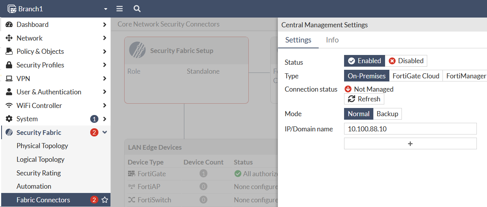
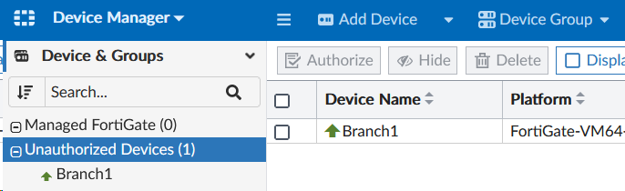

In this section we’ll onboard a FortiGate manually so that it checks into FortiManager. Onboarding a device to FortiManager can be done automatically using various methods (DHCP option, FortiZTP, FortiDeploy SKU), but we’ll do it manually for this lab.

---

## Onboard a FortiGate
1. Login to Branch1 using admin/```fortinet```
2. Navigate to **Security Fabric > Fabric Connectors**.
2. Click **Central Management**
    - Click **Enabled**
    - Type ```10.100.88.10``` in the **IP Address** field.
    - Click OK




## Confirm FortiGate is unauthorized in FortiManager
1. Login to FortiManager using admin/```fortinet```
2. Navigate to **Device Manager > Unauthorized Devices**
3. Confirm that the Branch1 FortiGate is listed

