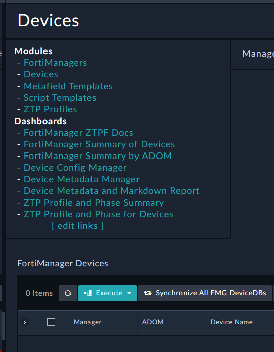
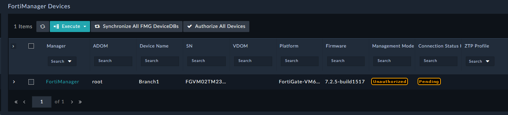
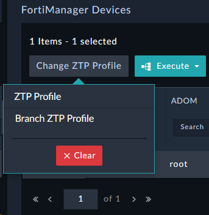
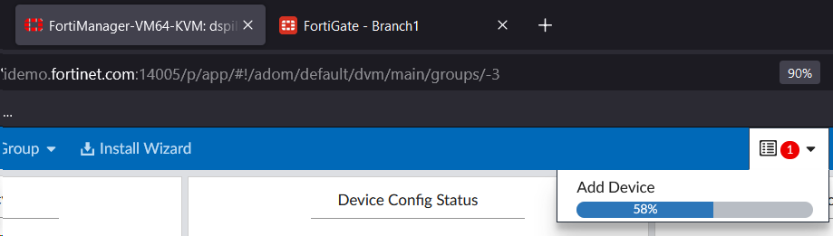
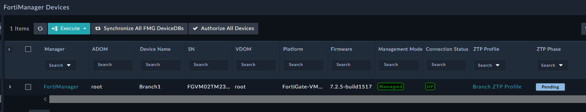
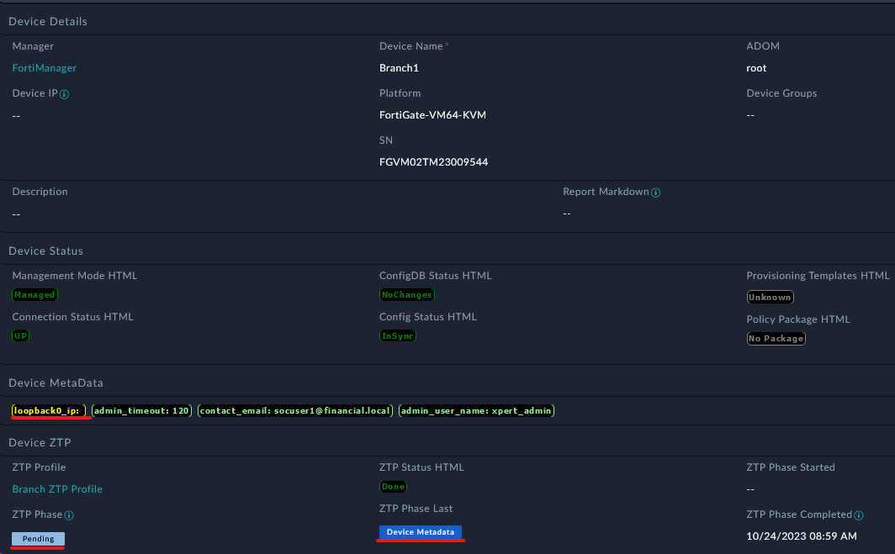

We're now ready to assign a profile to the FortiGate. Now you might be thinking "Wait, I thought we were doing ZTP?". We are, but there are some cases where you may need to restart the ZTP process. For example, if you need to change the ZTP profile, or if you need to re-onboard the device. In this cases, we'll assign the profile manually.

---

## Assign a ZTP Profile Manually
1. Login to FortiSOAR using csadmin/```$3curityFabr1c```
2. Navigate to the module FortiManager > Devices
3. Click **Synchronize All FMG DeviceDb's**

4. You will now see Branch1 listed in the table

5. Select the checkbox on that device and click **Change ZTP Profile > Branch ZTP Profile**

6. Switch back to FortiManager and you will see that the FortiGate is being authorized

7. Back on FortiSOAR the device will also show that the device is being managed

---

## Continuing the ZTP Process
When provisioning devices, there are often unique values that each device needs. For example, the device hostname, the device's IP address, etc. These values are often unique to each device, so we need a way to provide these values to the device. We can do this using a **Manual Input** in FortiSOAR. This input dialog can also be emailed to a user

1. Open the Branch1 Record by clicking on any non-hyperlinked part of the row (e.g. Manager or ZTP Profile Column values)
2. Notice that the **ZTP Phase** is now **Pending**, and that the loopback0_ip variable is Yellow and doesn't have a value. This means that the variable is not set.

3.