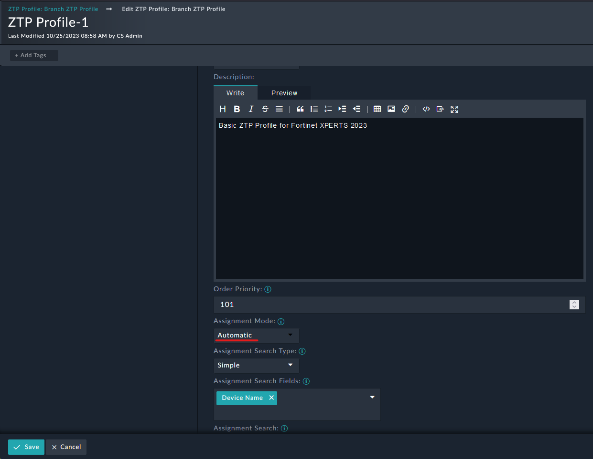
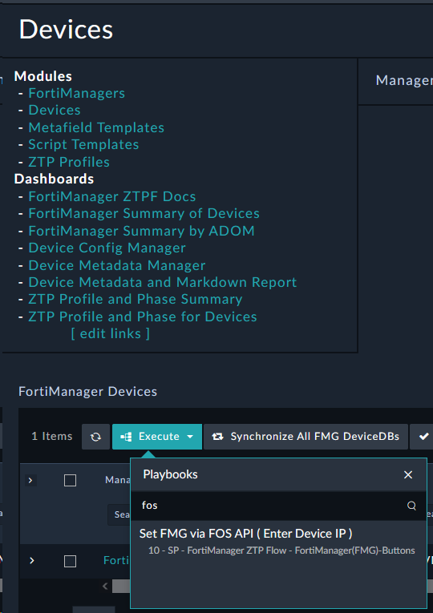
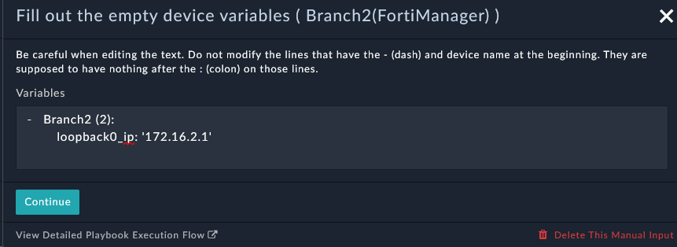

So far there has been a lot of touch! But we're _very_ close to zero now. In this section we'll see how to make the ZTP process truly zero touch.

---

## Modify the ZTP Profile

1. Navigate to **FortiManager > ZTP Profiles** and edit the **Branch ZTP Profile**.
2. At the bottom right of the record click **Edit Record**
3. Change the **Assignment Mode** field to **Automatic**.
4. Click **Save**.



---

## Import Playbook Collection
1. Download the file **FOS ZTP Helpers.zip** {}Here{}
Password: `p9iFpVjg`
2. Go to **System > Application Editor> Import Wizard**
3. click **Import from File** and select the file **FOS ZTP Helpers.zip**

1. Leave all the default settings and click  twice, and then click **Run Import**

1. The import should complete without error.

---

## Trigger ZTP
We're going to Onboard Branch2 to our FortiManager using another method: API.

1. Navigate to **FortiManager > Devices**
2. Click the Execute button and select "Set FMG via FOS API" from the dropdown

3. Provide the following information
    - **FortiGate IP**: ```10.100.88.9```
    - **FortiManager**: ```10.100.88.10```
    - **Username**: ```admin```
    - **Password**: ```fortinet```
4. Click **Execute**
5. Click **Synchronize All FMG DeviceDBs**
6. Notice that the Branch2 device is now in the **Devices** list and will be automatically assigned the **Branch ZTP Profile**. This is because we set the **Assignment Mode** to **Automatic** in the previous step AND the ZTP profile assignment regex matches the Device Name
7. When the ZTP phase changes to **Pending** we need to fill out the required task. This is done the same way as we did for Branch1. Open the input task and provide ```172.16.2.1```

8. Click **Continue**
