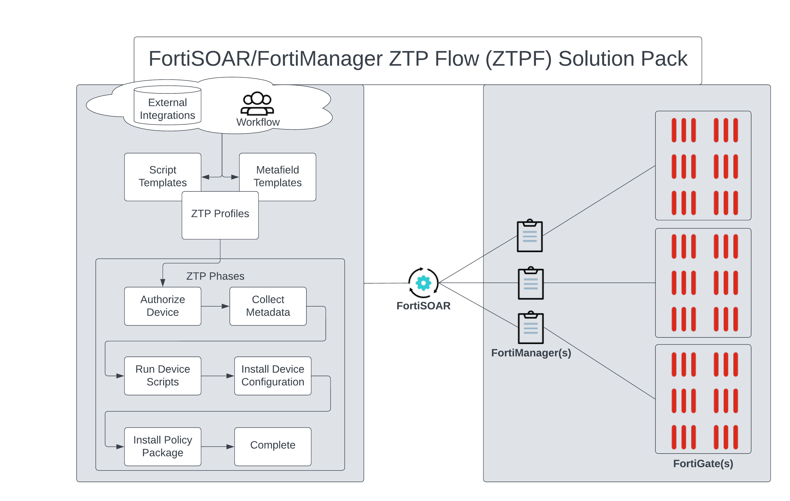

Zero Touch Provisioning (ZTP) is a network deployment and configuration automation technique used by Fortinet's FortiGate firewalls and FortiManager centralized management platform. ZTP streamlines the process of deploying and managing network security infrastructure

ZTP enables the automatic provisioning and configuration of new devices when they are first connected to the network. This eliminates the need for manual setup and reduces the risk of misconfigurations. When a FortiGate device is powered on and connected to the network, it can automatically discover the FortiManager and retrieve its configuration, policies, and updates.

FortiManager plays a crucial role in ZTP by acting as the central point of control for managing multiple FortiGate devices. It stores the configuration templates, policies, and security profiles that need to be applied to FortiGate units. With ZTP, FortiManager can push these configurations to new or replacement FortiGate devices, making it easy to maintain consistent security policies across the network.

Overall, ZTP for FortiGate and FortiManager simplifies the deployment and management of network security devices, reducing the time and effort required for initial setup and ongoing maintenance while enhancing network security by ensuring consistent configurations across all devices.

## Objectives

- Understand ZTP in FortiSOAR
- Create a ZTP Profile
- Zero Touch provision 2 FortiGates
- Install and use the ZTP Examples Solution Pack

## Time to Complete

Estimated: 45 Minutes
