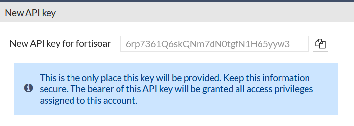

We want to create a new API Admin, called **“fortisoar”** to use the Fortigate API and extract existing policies from the configuration

---

1. Access the FortiGate by clicking on the **Enterprise_Core** **HTTPS** button from your demo instance or by browsing to `https://<your instance>.fortidemo.fortinet.com:14002/` 

2. Navigate to **System > Administrators**

3. Create a **New Rest API Admin**, called “**fortisoar**”, in your **Enterprise_Core** FortiGate, using the Administrator profile of **api_full** and hit OK to get your API Key. 

4. Save **Your New API Key** to be used in a FortiSOAR connector config. 

---

4. Back to FortiSOAR, go to **Automation>Connectors>Manage** and search for “**FortiGate**” and open the “**Fortinet FortiGate Custom**” connector. 

5. Make sure the hostname matches “**10.100.88.1**“ and click **Set API Key** to set the Key you obtained for the “fortisoar” API user from the FortiGate.

|||
|:-----:|:-----:|
|||

1. After you save you should see a successful status message. 