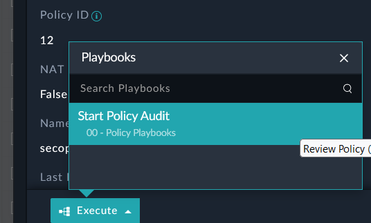
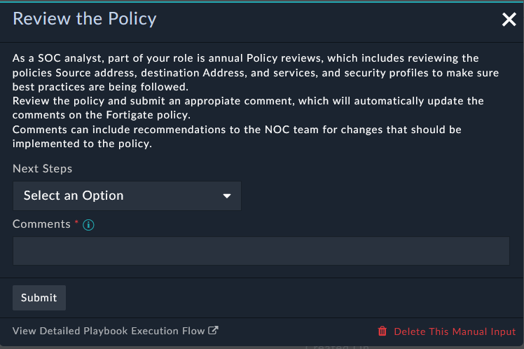
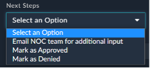

The goal of this section is to complete an audit of the firewall policy and approve a policy. We will then update the FortiGate config with comments indicating that this policy has been reviewed. We could also put rules inside FortiSOAR to repeat this audit according to business requirements.

---

1. Go back to the **Policies** Module and click on the **dmz-to-inet** record to open the policy.

2. At the bottom of the page, click the blue **Execute** button, then click “**Start Policy Audit**”. You will see a Manual Input Box appear.

|||
|:-----:|:-----:|
|||

<!-- 3. If you do NOT see a pop-up then look for the Manual Notification in the toolbar.  -->

4. Click on the **Next Steps** field dropdown (sometimes called a picklist), and you will see 3 options. Select **Mark as Approved** and enter “**Review Approved**” in the Comments field.
Click **Submit**. 

5. Check the Execution History for this policy by clicking on the  icon at the top right. You will see all of the playbooks that have executed on this specific record. 

6. Wait for the playbook “**> Update comments on the FortiGate**” to complete. 

7. In the FortiGate config we can see that we updated the policy with a comment. 