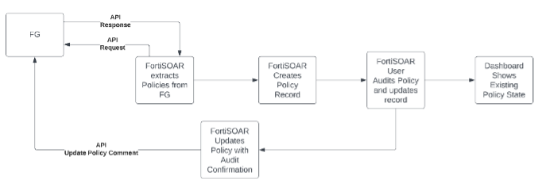

The power of FortiSOAR is in the ability to customize solutions. The ways you can build, tweak, and polish your solutions are endless. In this section we will outline a customized module for managing the workflow to auditing existing policies on a FortiGate for our security posture hygiene. This module has been built for you to simplify the steps.

## Objectives

- Understand Modules
- Build a Custom Module
- Work with Custom Module

## Time to Complete

Estimated: 30 Minutes
